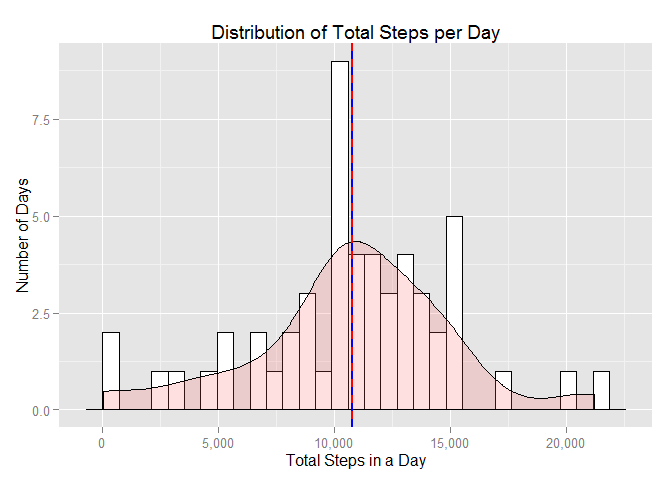
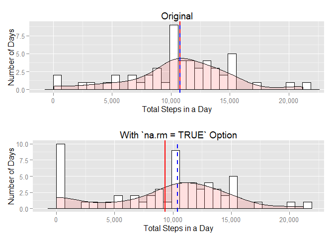
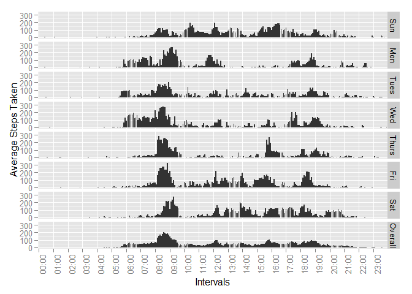

# Reproducible Research: Peer Assessment 1


Loading and preprocessing the data
--------------------------------------------------------------------------------

Before analyzing the data, we need to load the data into R. The assignment
instructions inform us that the input data contains three columns: `steps`,
`date`, and `interval`. Furthermore the instructions indicate that the dataset
is stored in a comma-separated-value (CSV) file and that there are a total of
17,568 observations in it. The input data is in the file `activity.zip`. From
the extension, we will assume that it is in compressed format.

Just to make sure that our assumption is correct and to get a sense of the
input data, we will take a quick peek at a few records from the input file.
For this task we could use external programs like `head` or `tail`. However,
while these are usually available on *nix systems, they are not available on
standard Windows systems (unless added on later by Cygwin or msys etc.).

To remain platform-agnostic, instead of using `read.csv()` from the base R
system we will use the `fread()` function from the `data.table` package. Also,
the data loading code assumes that open source 7-Zip archive management
software is available in the in the search path of the OS.


```r
# Set the working directory and get the contents of the .zip file
setwd("~/Coursera/Data Science Specialization/5. Reproducible Research/RepData_PeerAssessment1")
cat(paste(system("7za l activity.zip", intern = TRUE), "\n"))
```

```
##  
##  7-Zip (a) [64] 9.38 beta  Copyright (c) 1999-2014 Igor Pavlov  2015-01-03 
##   
##  Listing archive: activity.zip 
##   
##  -- 
##  Path = activity.zip 
##  Type = zip 
##  Physical Size = 53559 
##   
##     Date      Time    Attr         Size   Compressed  Name 
##  ------------------- ----- ------------ ------------  ------------------------ 
##  2014-02-11 11:08:20 .....       350829        53385  activity.csv 
##  ------------------- ----- ------------ ------------  ------------------------ 
##  2014-02-11 11:08:20             350829        53385  1 files 
##   
##  Kernel  Time =     0.000 =    0% 
##  User    Time =     0.000 =    0% 
##  Process Time =     0.000 =    0%    Virtual  Memory =      3 MB 
##  Global  Time =     0.017 =  100%    Physical Memory =      5 MB
```

```r
# Load the data.table package
library(data.table)

# Read the data into a data.table with default fread() options
dt = fread("7za e -so activity.zip activity.csv 2>nul")

# Take a look at the data
str(dt)
```

```
## Classes 'data.table' and 'data.frame':	17568 obs. of  3 variables:
##  $ steps   : int  NA NA NA NA NA NA NA NA NA NA ...
##  $ date    : chr  "2012-10-01" "2012-10-01" "2012-10-01" "2012-10-01" ...
##  $ interval: int  0 5 10 15 20 25 30 35 40 45 ...
##  - attr(*, ".internal.selfref")=<externalptr>
```

```r
dt
```

```
##        steps       date interval
##     1:    NA 2012-10-01        0
##     2:    NA 2012-10-01        5
##     3:    NA 2012-10-01       10
##     4:    NA 2012-10-01       15
##     5:    NA 2012-10-01       20
##    ---                          
## 17564:    NA 2012-11-30     2335
## 17565:    NA 2012-11-30     2340
## 17566:    NA 2012-11-30     2345
## 17567:    NA 2012-11-30     2350
## 17568:    NA 2012-11-30     2355
```

The instructions indicate that the variable `interval` is the identifier for
5-minute intervals. The first intervals start with the series [0, 5, 10, ...],
and if it were a continuous series during the day, we would expect the
following:


```r
# Number of intervals in a day
intervals_per_hour = 60/5
intervals_per_day = 24 * intervals_per_hour

# Sequence of intervals for one day
data.table(seq(from = 0, by = 5, length.out = intervals_per_day))
```

```
##        V1
##   1:    0
##   2:    5
##   3:   10
##   4:   15
##   5:   20
##  ---     
## 284: 1415
## 285: 1420
## 286: 1425
## 287: 1430
## 288: 1435
```

The tail end of the source dataset doesn't match this vector. In fact, it looks
more like the time of the day in 24-hour format, but without the ":" separator.
To confirm this, we can take a quick look at the end of the hour and the end of
the day:


```r
# Check out the end of the first hour
dt[(intervals_per_hour - 1):(intervals_per_hour + 2)]
```

```
##    steps       date interval
## 1:    NA 2012-10-01       50
## 2:    NA 2012-10-01       55
## 3:    NA 2012-10-01      100
## 4:    NA 2012-10-01      105
```

```r
# Check out the 24-hour boundary between the first and second day
dt[(intervals_per_day - 1):(intervals_per_day + 2)]
```

```
##    steps       date interval
## 1:    NA 2012-10-01     2350
## 2:    NA 2012-10-01     2355
## 3:     0 2012-10-02        0
## 4:     0 2012-10-02        5
```

It looks like the `interval` column is actually the time of the day, but it is
formatted as a number: e.g. `55` is followed by `100`; `2355` is followed by
`0`, etc. In case we need a properly formatted `interval` and a proper date and
time variable in later steps, we will transform them and keep them in a new
Date/Time column.


```r
# Load lubridate package for easy handling of dates/times
library(lubridate)

# Reformat date and time and convert to date/time class
dt[, interval := sub("^(..)", "\\1:", sprintf("%04d", interval))]
dt[, timestamp := ymd_hm(paste(date, interval))]
dt[, date := ymd(date)]
str(dt)
```

```
## Classes 'data.table' and 'data.frame':	17568 obs. of  4 variables:
##  $ steps    : int  NA NA NA NA NA NA NA NA NA NA ...
##  $ date     : POSIXct, format: "2012-10-01" "2012-10-01" ...
##  $ interval : chr  "00:00" "00:05" "00:10" "00:15" ...
##  $ timestamp: POSIXct, format: "2012-10-01 00:00:00" "2012-10-01 00:05:00" ...
##  - attr(*, ".internal.selfref")=<externalptr>
```


What is mean total number of steps taken per day?
--------------------------------------------------------------------------------

To summarize data by group, we can use the `aggregate()` function from the base
R system, or utilize the modern interfaces provided in `data.table` or `dplyr`
packages. For this assignment, we will use `data.table` interface.

This section will try to analyze the distribution of the total number of steps
taken per day throughout the study period using a histogram, then provide the
mean and the median of this metric as formal descriptors of its distribution.


```r
# Get the steps by date, but don't remove NAs: this will make sure that if all
# the intervals in a day have NAs, the day's total steps will also be NA.
# If we remove them, the sum for the day will be zero and the daily average of
# the total steps will be incorrectly underestimated.
steps_by_date = dt[, .( total_steps = sum(steps) ), date]

# Load the ggplot2 library
library(ggplot2)

# For comma formatted axis labels
require(scales)

# Create a function to plot the data with ggplot
plot_it = function(dt_to_plot) {
  ggplot(dt_to_plot, aes(x = total_steps)) +
    geom_histogram     ( colour = "black", fill = "white") +
    ggtitle            ( "Distribution of Total Steps per Day") +
    xlab               ( "Total Steps in a Day") +
    ylab               ( "Number of Days") +
    scale_x_continuous ( labels = comma) +
    geom_density       ( aes(y = ..scaled..*4.35), alpha = 0.2, fill = "#FF6666") +
    geom_vline         ( aes(xintercept = mean(total_steps, na.rm = TRUE)),   color = "red", size = 1) +
    geom_vline         ( aes(xintercept = median(total_steps, na.rm = TRUE)), color = "blue", linetype = "dashed", size = 1)
}

plot_it(steps_by_date)
```

```
## Warning: Removed 8 rows containing non-finite values (stat_density).
```

 

```r
# Get the mean and median: now we have to use na.rm to remove days with NAs
stats = steps_by_date[,
  .(
    mean   = mean(total_steps, na.rm = TRUE),
    median = median(total_steps, na.rm = TRUE)
  )
]

stats
```

```
##        mean median
## 1: 10766.19  10765
```

During the study period, after removing the missing data, the mean steps taken
per day was **10,766.19**, shown as a red
vertical line on the plot. The median steps taken per day was
**10,765**, shown with blue vertical
dashes.


### A note about the `na.rm` option in `sum()`

In the instructions for the above analysis, there is a specific comment about
"ignoring the missing values in the dataset". This could mean "removing" them
from the analysis as in `sum(..., na.rm = TRUE)`, or it could mean doing
nothing about them, i.e. use `sum(...)` which is the same as `sum(..., na.rm =
FALSE)`. In the distribution example above, we used the `sum()` function
twice, and only in one of them we used the option `na.rm = TRUE`. This was an
important feature of the analysis, because doing it differently would yield a
very diffent result. In this section, we will repeat the analysis using the
alternative approach and illustrate how it is different from the correct
approach.


```r
# Original approach
plot1 = plot_it(steps_by_date)

# Alternative approach
steps_by_date_alt = dt[, .( total_steps = sum(steps, na.rm = TRUE) ), date]
plot2 = plot_it(steps_by_date_alt)

# Stack the two plots
require(grid)
grid.newpage()
pushViewport(viewport(layout = grid.layout(nrow = 2, ncol = 1)))
print(plot1, vp = viewport(layout.pos.row = 1, layout.pos.col = 1))
```

```
## Warning: Removed 8 rows containing non-finite values (stat_density).
```

```r
print(plot2, vp = viewport(layout.pos.row = 2, layout.pos.col = 1))
```

 

```r
# Summary stats for the original approach
summary(steps_by_date)
```

```
##       date             total_steps   
##  Min.   :2012-10-01   Min.   :   41  
##  1st Qu.:2012-10-16   1st Qu.: 8841  
##  Median :2012-10-31   Median :10765  
##  Mean   :2012-10-31   Mean   :10766  
##  3rd Qu.:2012-11-15   3rd Qu.:13294  
##  Max.   :2012-11-30   Max.   :21194  
##                       NA's   :8
```

```r
# Summary stats for the alternative approach
summary(steps_by_date_alt)
```

```
##       date             total_steps   
##  Min.   :2012-10-01   Min.   :    0  
##  1st Qu.:2012-10-16   1st Qu.: 6778  
##  Median :2012-10-31   Median :10395  
##  Mean   :2012-10-31   Mean   : 9354  
##  3rd Qu.:2012-11-15   3rd Qu.:12811  
##  Max.   :2012-11-30   Max.   :21194
```

The results show that, using the `na.rm = TRUE` option introduces eight days
with total step count of zero, which moves the mean (red vertical line) and
the median (blue vertical dashes) towards the left.


What is the average daily activity pattern?
--------------------------------------------------------------------------------

To show the daily activity pattern, we will plot the average steps taken at
each interval over the duration of the study.


```r
# Average of steps taken by interval over the study period
steps_by_interval = dt[, .(average_steps = sum(steps, na.rm = TRUE)), interval]

# Info on the interval with the max average steps
max_step_index     = steps_by_interval[, which.max(average_steps)]
max_steps          = steps_by_interval[max_step_index, average_steps]
max_steps_interval = steps_by_interval[max_step_index, interval]

# There are too many intervals to be plotted: pick the top of the hour to label
# the tick marks
labels = steps_by_interval[seq(1, length(interval), 12), interval]

# Line graph of average activity during the day
activity = ggplot(steps_by_interval, aes(x = interval, y = average_steps, group = 1)) +
  geom_line          ( ) +
  ggtitle            ( "Average Daily Activity Pattern") +
  xlab               ( "Intervals") +
  ylab               ( "Average Steps Taken") +
  scale_x_discrete   ( breaks=labels, labels=as.character  ( labels)) +
  scale_y_continuous ( labels = comma) +
  theme              ( axis.text.x=element_text            ( angle=90))

# Now, add the info about the max steps to the plot and show it
activity +
  geom_segment(
    linetype = "longdash",
    colour   = "blue",
    aes(x = max_step_index, y = -Inf, xend = max_step_index, yend = max_steps)
  ) +
  geom_text(
    x     = max_step_index,
    y     = max_steps,
    label = prettyNum(max_steps, big.mark = ","),
    hjust = 0,
    vjust = 0
  ) +
  geom_text(
    x     = max_step_index,
    y     = 0,
    label = max_steps_interval,
    hjust = 0.25,
    vjust = 1.25,
    angle = 90
  )
```

 

On the average, the maximum number of steps during a 5 minute interval were
**10,927**, taken at
**08:35**.


Imputing missing values
--------------------------------------------------------------------------------

There are a number of cases where there are no observations for an interval or
an entire day (coded as NA). The presence of missing data may introduce bias
into some calculations or summaries of the data. The following code chunk shows
the number of intervals with missing data.


```r
# Intervals with missing values
nrow(na.omit(dt, invert = TRUE))
```

```
## [1] 2304
```

Note that having some intervals with missing data may have different
implications than having entire days without data, especially if more of some
specific days had missing data. The following section provides some comparisons.


```r
# Days without data
missing_days = dt[,
  .(
    nmiss   = nrow(na.omit(.SD, invert = TRUE)),
    weekday = wday(date, label = TRUE, abbr = TRUE)
  ),
  date
][nmiss > 0]

missing_days
```

```
##          date nmiss weekday
## 1: 2012-10-01   288     Mon
## 2: 2012-10-08   288     Mon
## 3: 2012-11-01   288   Thurs
## 4: 2012-11-04   288     Sun
## 5: 2012-11-09   288     Fri
## 6: 2012-11-10   288     Sat
## 7: 2012-11-14   288     Wed
## 8: 2012-11-30   288     Fri
```

```r
# Percentage of days with missing data
nrow(missing_days)/uniqueN(dt[, date])*100
```

```
## [1] 13.11475
```

It looks like whenever there is a missing observation, an entire day's worth
of data are missing. From the above summary, there doesn't appear to be a
pattern to the days with missing data. One approach to imputing data for these
missing intervals is to assign the average number of steps taken across the
entire span of the study period.

An alternative approach is to get the average of the interval for specific
days of the week: it is likely that a person's daily activity on a weekend day
will be more similar to another weekend day rather than a week day. We can
extend the same logic and assume that the expected activity pattern on a
Monday will be similar to the average of activities across all Mondays; and
the expected activity pattern on a Tuesday will be more like the activity on
other Tuesdays, etc.


```r
# Calculate average steps by interval, overall
estimates_overall = dt[,
  .(nobs = sum(!is.na(steps)), average_steps = mean(steps, na.rm = TRUE)),
  interval
]
setkey(estimates_overall, interval)

# Calculate average steps by interval, by week day
estimates_weekday = dt[,
  .(nobs = sum(!is.na(steps)), average_steps = mean(steps, na.rm = TRUE)),
  .(weekday = wday(date, label = TRUE, abbr = TRUE), interval)
]
setkey(estimates_weekday, weekday, interval)

# Review if these methods yield very different extimates
comb = rbind(
  estimates_overall[, weekday := "Overall"],
  estimates_weekday
)

# See a comparison of these estimates
ggplot(comb, aes(x = interval, y = average_steps)) +
  facet_grid       ( weekday ~ .) +
  geom_bar         ( stat = "identity") +
  xlab             ( "Intervals") +
  ylab             ( "Average Steps Taken") +
  scale_x_discrete ( breaks = labels, labels = as.character(labels)) + theme(axis.text.x = element_text(angle = 90))
```

 

It is clear from these plots that applying day-of-week-specific averages will
give us better estimates to impute the missing data points.


```r
# To compare the alternative estimation methods, create two imputed variables
dt[is.na(steps),
  `:=`(
    imputed_flag = TRUE,
    imputed_weekday = estimates_weekday[
      .SD[, .(weekday = wday(date, label = TRUE, abbr = TRUE), interval)],
      average_steps
    ],
    imputed_overall = estimates_overall[
      .SD[, interval],
      average_steps
    ]
  )
]
dt[!is.na(steps),
  `:=`(
    imputed_flag    = FALSE,
    imputed_weekday = steps,
    imputed_overall = steps
  )
]

# No need to summarize, ggplot aggregates correctly
stacked = rbind(
  dt[, .(date, interval, Method = "1. Original", Imputed = "No", steps)],
  dt[is.na(steps),
    .(
      date,
      interval,
      Method  = "2. Impute: Overall",
      Imputed = "Yes",
      steps   = estimates_overall[.SD[, interval], average_steps]
    )
  ],
  dt[!is.na(steps), .(date, interval, Method = "2. Impute: Overall", Imputed = "No", steps)],
  dt[is.na(steps),
    .(
      date,
      interval,
      Method  = "3. Impute: Weekday",
      Imputed = "Yes",
      steps   = estimates_weekday[
        .SD[, .(weekday = wday(date, label = TRUE, abbr = TRUE), interval)],
        average_steps
      ]
    )
  ],
  dt[!is.na(steps), .(date, interval, Method = "3. Impute: Weekday", Imputed = "No", steps)]
)

# Plot this, show both the original and the imputed variables
ggplot(stacked, aes(x = date, y = steps, fill = Imputed)) +
  geom_bar(stat = "identity") +
  facet_grid(Method ~ .) +
  xlab("Date") +
  ylab("Steps")
```

 

Now, let's review if the mean and the median were affected because we have
imputed values for the missing data.


```r
# mean steps taken - comparison
stacked[,
  .(total_steps = sum(steps, na.rm = TRUE)),
  .(date, Method)
][,
  .(.N, mean = mean(total_steps), median = median(total_steps)),
  Method
]
```

```
##                Method  N     mean   median
## 1:        1. Original 61  9354.23 10395.00
## 2: 2. Impute: Overall 61 10766.19 10766.19
## 3: 3. Impute: Weekday 61 10821.21 11015.00
```

This result is somewhat unexpected: when we replace the missing values with
the mean of the sample (i.e. `impute_overall`), the mean should not change.
Upon further inspection, we can see that when the `sum()` function's
`na.rm=TRUE` option is used, if all the intervals for a day have missing
values, the `by` processing keeps the day, and the `sum()` evaluates to zero.
If we take the means of the aggreated days, the resulting mean is lower than
what it should be because we are including extra zeros in the calculation. To
correct this problem, we need to omit the entire row if there is a missing
value.


```r
# mean steps taken - corrected comparison
na.omit(stacked[,
  .(total_steps = sum(steps)),
  .(date, Method)
])[,
  .(.N, mean = mean(total_steps), median = median(total_steps)),
  Method
]
```

```
##                Method  N     mean   median
## 1:        1. Original 53 10766.19 10765.00
## 2: 2. Impute: Overall 61 10766.19 10766.19
## 3: 3. Impute: Weekday 61 10821.21 11015.00
```

As we can see from the above results, the mean total steps per day didn't
change for *impute method 1*. The median is slightly higher now, and it is the
same as the mean. For *impute method 2*, both the mean and the median are
higher after the missing data were replaced with imputed values: using the
day-of-week-specific interval averages results in higher mean and median steps
taken per day because the subject has taken fewer steps during the weekend
days on the average compared to the week days, and there are more week days
with missing data compared to weekend days (see the next section).


Are there differences in activity patterns between weekdays and weekends?
--------------------------------------------------------------------------------
